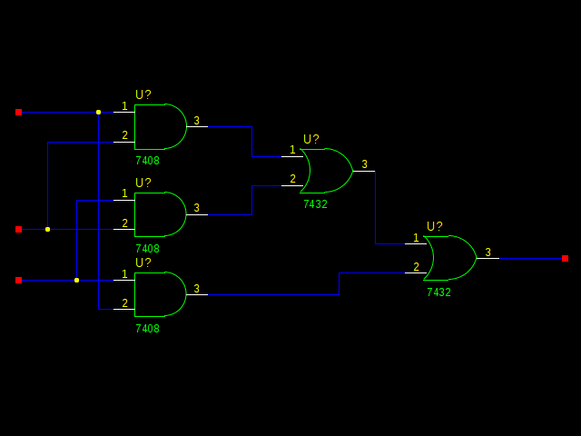
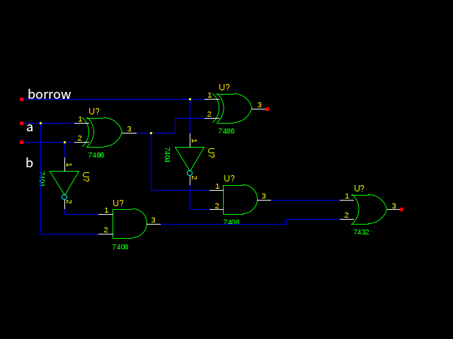

Ch4 Homework
============

EXERCISE
--------

### 15.

#### a.
If not use compression this audio takes
$3 * 60(s) * 40000(bit/s) = 7200000(bits)$

If use compression it takes
$7200000(bits) * \frac{1}{5} = 1440000(bits)$

#### b.
If this image has no compression it takes
$1200 * 800 * 8(bits) * 3 = 23040000(bits)$

But it just takes 2.4Mbits = $2.4 * 2^{20} = 2516583$

So, compression ratio is $23040000 : 2516583 = 9 : 1$

### 24.

### 26.

CHALLENGE WORK
--------------
### 1.

### 3.
1.  Requirements and guidelines
2.  Compliance testing
3.  Extensions
4.  Registration of JPEG profiles, SPIFF profiles, SPIFF tags, SPIFF colour spaces, APPn markers, SPIFF compression types and Registration Authorities (REGAUT)
5.  JPEG File Interchange Format
6.  Application to printing systems
